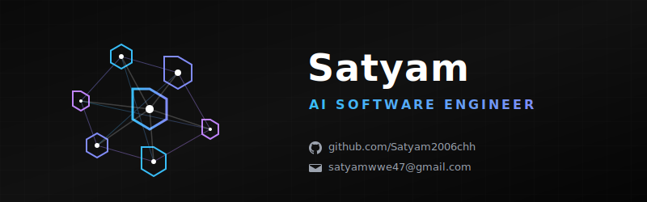

  <!-- AI Banner created via SVG for ultra-wide, high-quality rendering -->
  

 

---

### 💫 𝗔𝗯𝗼𝘂𝘁 𝗠𝗲

**AI Software Engineer** focused on building intelligent applications using **Large Language Models (LLMs)**, **Retrieval-Augmented Generation (RAG)**, and multi-agent systems. Skilled in integrating AI capabilities into full-stack applications, developing REST APIs, and working with modern frameworks to create scalable, real-world solutions.

---

### 🌐 𝗖𝗼𝗻𝗻𝗲𝗰𝘁 𝘄𝗶𝘁𝗵 𝗠𝗲

  &nbsp;
  

---

### 💻 𝗧𝗲𝗰𝗵 𝗦𝘁𝗮𝗰𝗸

#### 𝗔𝗜 & 𝗟𝗟𝗠 𝗗𝗲𝘃𝗲𝗹𝗼𝗽𝗺𝗲𝗻𝘁
   

#### 𝗣𝗿𝗼𝗴𝗿𝗮𝗺𝗺𝗶𝗻𝗴 𝗟𝗮𝗻𝗴𝘂𝗮𝗴𝗲𝘀
   

#### 𝗕𝗮𝗰𝗸𝗲𝗻𝗱 & 𝗔𝗣𝗜 𝗗𝗲𝘃𝗲𝗹𝗼𝗽𝗺𝗲𝗻𝘁
   

#### 𝗙𝗿𝗼𝗻𝘁𝗲𝗻𝗱 𝗧𝗲𝗰𝗵𝗻𝗼𝗹𝗼𝗴𝗶𝗲𝘀
    

#### 𝗗𝗮𝘁𝗮𝗯𝗮𝘀𝗲𝘀 & 𝗗𝗮𝘁𝗮 𝗠𝗮𝗻𝗮𝗴𝗲𝗺𝗲𝗻𝘁
  

#### 𝗗𝗮𝘁𝗮 𝗔𝗻𝗮𝗹𝘆𝘀𝗶𝘀 & 𝗩𝗶𝘀𝘂𝗮𝗹𝗶𝘇𝗮𝘁𝗶𝗼𝗻
   

#### 𝗧𝗼𝗼𝗹𝘀 & 𝗗𝗲𝘃𝗢𝗽𝘀
    

---

### 📊 𝗚𝗶𝘁𝗛𝘂𝗯 𝗦𝘁𝗮𝘁𝘀

  
  
    
  

---

  

