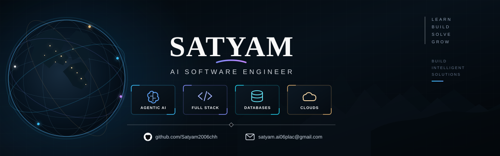

  <!-- Banner SVG -->
  

 

## 👋 Hi, I'm Satyam Chhabra

Software Engineer combining **Full-Stack Web Development** and **Generative & Agentic AI**, with hands-on experience in **Cloud Deployments (Azure)**. Passionate about building real-world AI applications, scalable microservices, and deploying practical web solutions.

* 💻 **Full-Stack Development:** Building modern reactive UIs, RESTful APIs, and scalable backend services using React, Node.js, and Python.
* 🤖 **Generative & Agentic AI:** Crafting intelligent LLM workflows, custom RAG pipelines, multi-agent systems, and vector search solutions.
* ☁️️ **Cloud & DevOps (Learning & Practicing):** Deploying projects using Azure services, containerizing apps with Docker, and hosting on modern platforms like Vercel.
* 🎯 **Career Focus:** Actively seeking Software Engineering, Full-Stack, and AI/ML entry-level roles.

---

### 🛠️ Tech Stack & Skills

#### 🤖 Generative AI, Agents & Data

  
  
  
  
  
  

#### ⚙️ Backend & APIs

  
  
  
  
  
  
  

#### 💻 Frontend

  
  
  
  
  
  

#### ☁️ Cloud, Databases & Developer Tools

  
  
  
  
  
  
  
  
  
  

---

### 📫 Connect & Reach Me

  
  

